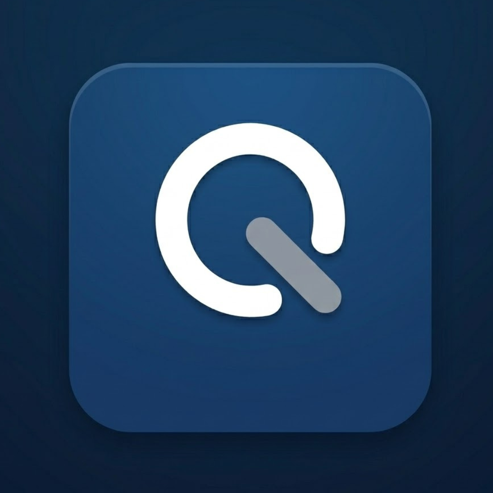
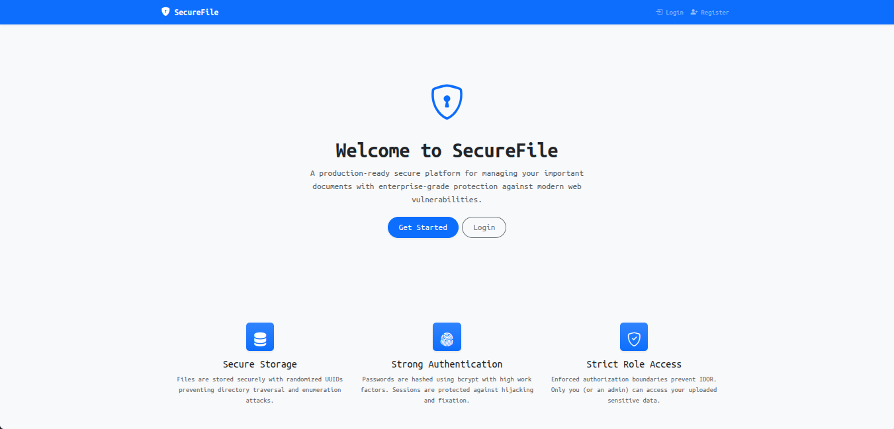
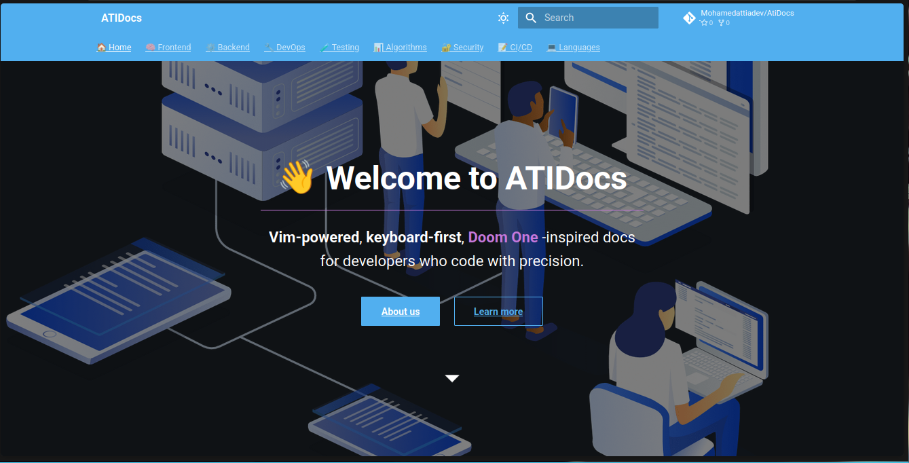
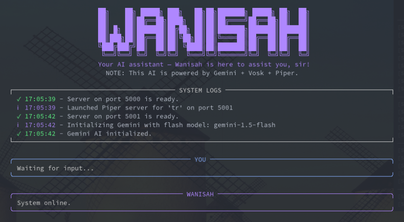
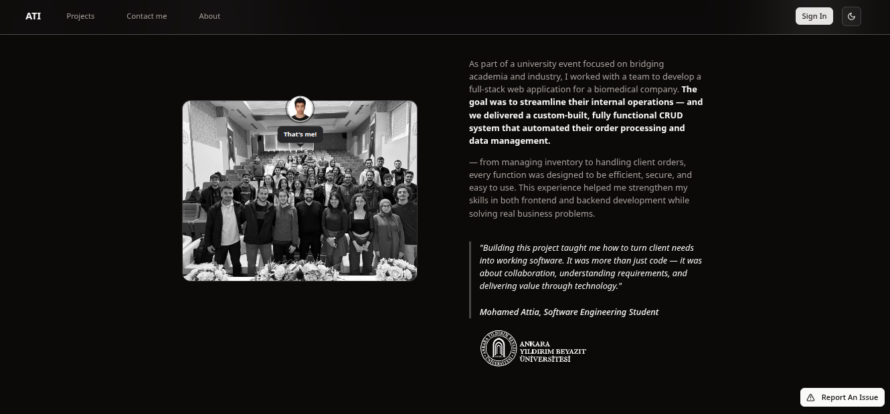
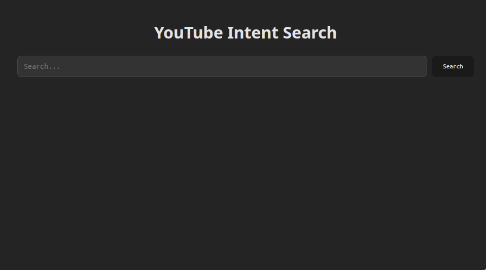
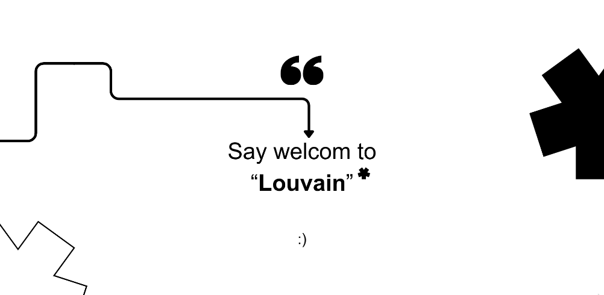
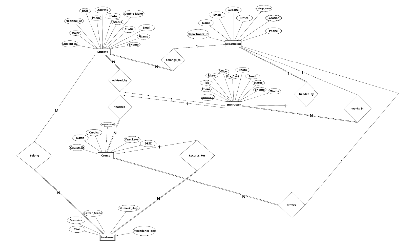
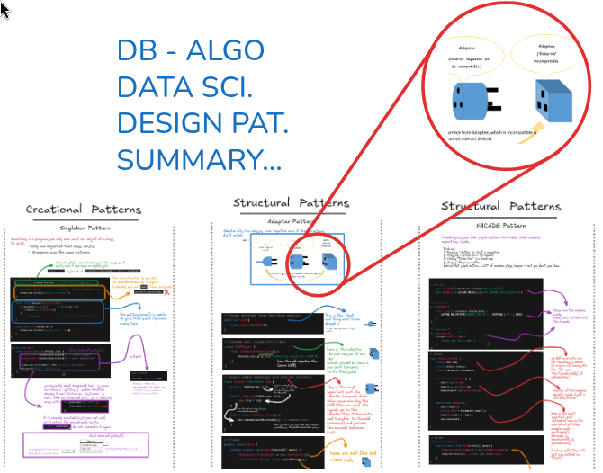

<h1 align="center">Hi, I'm Mohamed Attia</h1>

Software developer • using <strong>Arch</strong> btw

---

## About

I enjoy building software that is simple, reliable, and useful.

Most of my work is around web development, but I also explore developer tools and automation.

- Full-stack web applications  
- Workflow automation  
- Tools, APIs, and experimentation  

Recently interested in **drones and embedded systems**.

---

<table width="100%" >
<tr>

<td width="45%" valign="top">

<b>Contact</b> 

</td>

<td width="55%" valign="top">

<b>Tech</b> 

</td>

</tr>
</table>

---
<h2 align="center">Featured Projects</h2>
 

<table width="100%" cellpadding="20" cellspacing="10">
<tr>

<td width="33%" align="center">

 

<b>Qtile Dotfiles (My Linux Config)</b>

</td>

<td width="33%" align="center">

 

<b>SecureFile</b>

</td>

<td width="33%" align="center">

 

<b>AtiDocs</b>

</td>

</tr>

<tr>

<td align="center">

 

<b>Wanisah AI</b>

</td>

<td align="center">

 

<b>Historical Archive</b>

</td>

<td align="center">

 

<b>IntentTube</b>

</td>

</tr>

<tr>

<td align="center">

 

<b>Algorithm Visualizer</b>

</td>

<td align="center">

 

<b>University DBMS</b>

</td>

<td align="center">

 

<b>Study Summaries</b>

</td>

</tr>
</table>

---

<h2 align="center">Activity</h2>

